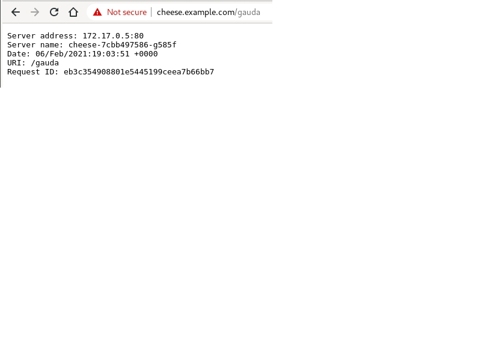
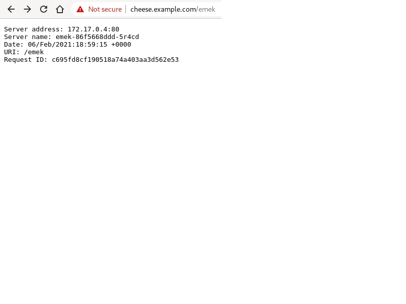

## ingress-per-ns

production = gauda
#### https://cheese.example.com/gauda

```
kubectl get all -n production
NAME                          READY   STATUS    RESTARTS   AGE
pod/cheese-7cbb497586-g585f   1/1     Running   0          56m

NAME                TYPE        CLUSTER-IP      EXTERNAL-IP   PORT(S)   AGE
service/gauda-svc   ClusterIP   10.97.228.231   <none>        80/TCP    5h3m

NAME                     READY   UP-TO-DATE   AVAILABLE   AGE
deployment.apps/cheese   1/1     1            1           5h3m

NAME                                DESIRED   CURRENT   READY   AGE
replicaset.apps/cheese-7cbb497586   1         1         1       77m


kubectl get secret -n production
NAME                  TYPE                                  DATA   AGE
default-token-mvh6b   kubernetes.io/service-account-token   3      13h


* kubectl create configmap game-config --from-file=configs/

kubectl get cm -n production
NAME               DATA   AGE
game-config        2      116m
kube-root-ca.crt   1      13h

```




development=emek
#### https://cheese.example.com/emek

```
kubectl get all -n development
NAME                        READY   STATUS    RESTARTS   AGE
pod/emek-86f5668ddd-5r4cd   1/1     Running   0          5h3m

NAME               TYPE        CLUSTER-IP      EXTERNAL-IP   PORT(S)   AGE
service/emek-svc   ClusterIP   10.108.24.246   <none>        80/TCP    5h3m

NAME                   READY   UP-TO-DATE   AVAILABLE   AGE
deployment.apps/emek   1/1     1            1           5h3m

NAME                              DESIRED   CURRENT   READY   AGE
replicaset.apps/emek-86f5668ddd   1         1         1       5h3m
```


